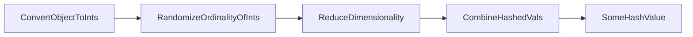

# Hashing With Chaining
> _Notes based on [opendatastructures.org][1]._ <br>
> _Notes based on [opendatastcs.rmit.edu.au][3]._ <br>

Hash Tables are a good data-structure for storing a small subset of a much larger set of integers.
- $`U = \{ 0, 1, 2, ..., (2^w - 1) \} `$ is a large range of integers, hash table math is usually based on powers of $`2`$
- If $` A \subset U`$, then $`n = |A|`$ is the size of the subset

`Chained Hash Tables` implement a hashing mechanism over a generic set of `List` structures. 

A chained hashtable can be visualized as this,

![Visualized Chained Hash Table][2]

And coded with these attributes,
```java
    List<T>[] t; // hashtable of chains
    int n; // element count
```

The basic idea is that Hash Tables hijack dimensionality reduction and use the reduced dimensionality to quickly `search(x)`, `access(i)`, `insert(x)` and `delete(x)`.

As a safeguard against performance hits and problems of reduced dimensionality, hash tables can maintain this invariant,
```math
n \leq t.length
```
The above invariant expects that the hashing algorithm is distributed and random enough so that on average have $`1/t.length \leq 1`$ per hash index. Opposingly, having $`n`$ elements stored at any given hash is bad!

## Add to Hash Table
1. check item does not exist
2. check capacity -> grow if needed
3. calculate hash
4. access hash index and set value
5. increment element count
```java
    boolean add(T x) {
        if (find(x) != null) return false;
        if (n+1 > t.length) resize(); // will require reinserting set objects with new hashes
        t[hash(x)].add(x);
        n++;
        return true;
    }
```

## Remove from Hash Table
1. Calculate Hash
2. Access HashTable at hash
3. Iterate over List found at hash index
4. Delete list entries corresponding to param
5. return val
```java
    T remove(T x) {
        Iterator<T> it = t[hash(x)].iterator();
        while (it.hasNext()) {
            T y = it.next();
            if (y.equals(x)) {
                it.remove();
                n--;
                return y;
            }
        }
        return null;
    }
```

## Find val in Hash Table
1. Calc hash
2. Access Hash Table at hash index
3. iter through list
4. return matching val
```java
    T find(Object x) {
        for (T y : t[hash(x)])
            if (y.equals(x))
                return y;
        return null;
    }
```

## Multiplicative Hashing
Efficient method for generating hashes based on modular arithmetic and integer division.

### General Hashing Process
The general hashing process is something like,


$`\div`$ operator is needed for multiplicative hashing.
The $`\div`$ expresses the multiplicative factor between two numbers as an integer.
$`a \div b = \lfloor a/b \rfloor \text{, when } a \geq 0, b \geq 1`$

__Randomize Ordinality__,
- Without randomization two numbers would hash very similarly
- For example hashing `hash(128)` and `hash(129)`, by just reducing the dimensionality might just truncate those numbers
    - where $`hash(2^7) \to 2^2`$ and $`hash(2^7 + 2^0) \to 2^2`$
    - by randoming, $`hash(2^7*someFraction) \to hash(2^7 + 2^2 + 2^1) \to 2^2 + 2^1`$ and $`hash(2^7 + 2^0 * someFraction) \to hash(2^3 + 2^0) \to 2^3 + 2^0`$, the input values are transformed into disimilar hash values. This also means that similar object won't create a _chained list_


__Reducing Dimensionality__,
- Imagine a large range and set of integers $`U = \{ 0, 1, 2, ..., (2^w - 1) \} `$.
- Imagine having to reduce that range of integers to a new range $`I = \{ 0, 1, 2, ..., (2^d - 1) \} `$.
- $`d`$ is the new dimension and the goal is to __surjectively__ with normal distribution map $`\forall x_{i} \in U \mapsto y_{i} \in A`$

![Surjective Example][4]

__Combine Hash Values__
- In non-Integer implementations, hashing needs to be applied to each feature of an object contributing to it's hash. The list of hash values thus created need to be combined in some form to create the final hash value.

---
### Arithmetic Hashing
The arithmetic hash function looks like,
```math
hash(x) = ((r*x)\mod 2^w)\div 2^{w-d}
```
> __r__ is a randomize value - for the distributing x to a new value <br>
> __x__ is the integer to hash <br>
> __mod__ is an operation which at the bit-level is a left-to-right truncation of all bits greater than the mod value <br>
> __div__ is an operation which at the bit-level is a right-to-left truncation of all bits that are in the remainder <br>
> __div__ and __mod__ work together to select a subrange of the randomize `x` integers bit value <br>
> Similar to bitmasking, <br>
> ![Bitmasking Example][5]

In reality it is a sophisticate surjective linear transformation with probabalistically-low chances of collision when $`n \leq t.length`$.

In Java all this sophistication simplifies to a couple bit ops,
```java
    int hash(Object x) {
        return (z * x.hashCode()) >>> (w-d);
    }
```

#### Measuring Collision

Chances of collision in arithmetic hashing are, for $`x,y \in U = \{0, 1, ..., (2^w-1) \}`$,
```math
\Pr\{hash(x) = hash(y) \leq 2/2^d\}
```

[1]: http://www.opendatastructures.org
[2]: http://opendatastructures.org/ods-java/img1931.png
[3]: http://www.cs.rmit.edu.au/online/blackboard/chapter/05/documents/contribute/chapter/05/chaining.html
[4]: https://i.pinimg.com/originals/4c/8f/4c/4c8f4c05b62751429551f7960a90cf6b.gif
[5]: http://www.tcpipguide.com/free/diagrams/bitmasking.png