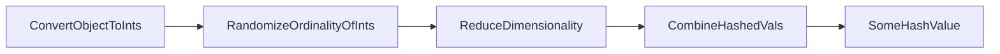

# Hashing With Chaining
> _Notes based on [opendatastructures.org][1]._ <br>
> _Notes based on [opendatastcs.rmit.edu.au][3]._ <br>

Hash Tables are a good data-structure for storing a small subset of a much larger set of integers.
- $`U = \{ 0, 1, 2, ..., (2^w - 1) \} `$ is a large range of integers, hash table math is usually based on powers of $`2`$
- If $` A \subset U`$, then $`n = |A|`$ is the size of the subset

`Chained Hash Tables` implement a hashing mechanism over a generic set of `List` structures. 

A chained hashtable can be visualized as this,

![Visualized Chained Hash Table][2]

And coded with these attributes,
```java
    List<T>[] t; // hashtable of chains
    int n; // element count
```

The basic idea is that Hash Tables hijack dimensionality reduction and use the reduced dimensionality to quickly `search(x)`, `access(i)`, `insert(x)` and `delete(x)`.

As a safeguard against performance hits and problems of reduced dimensionality, hash tables can maintain this invariant,
```math
n \leq t.length
```
The above invariant expects that the hashing algorithm is distributed and random enough so that on average have $`1/t.length \leq 1`$ per hash index. Opposingly, having $`n`$ elements stored at any given hash is bad!

## Add to Hash Table
1. check item does not exist
2. check capacity -> grow if needed
3. calculate hash
4. access hash index and set value
5. increment element count
```java
    boolean add(T x) {
        if (find(x) != null) return false;
        if (n+1 > t.length) resize(); // will require reinserting set objects with new hashes
        t[hash(x)].add(x);
        n++;
        return true;
    }
```

## Remove from Hash Table
1. Calculate Hash
2. Access HashTable at hash
3. Iterate over List found at hash index
4. Delete list entries corresponding to param
5. return val
```java
    T remove(T x) {
        Iterator<T> it = t[hash(x)].iterator();
        while (it.hasNext()) {
            T y = it.next();
            if (y.equals(x)) {
                it.remove();
                n--;
                return y;
            }
        }
        return null;
    }
```

## Find val in Hash Table
1. Calc hash
2. Access Hash Table at hash index
3. iter through list
4. return matching val
```java
    T find(Object x) {
        for (T y : t[hash(x)])
            if (y.equals(x))
                return y;
        return null;
    }
```

## Multiplicative Hashing
Efficient method for generating hashes based on modular arithmetic and integer division.

### General Hashing Process
The general hashing process is something like,


$`\div`$ operator is needed for multiplicative hashing.
The $`\div`$ expresses the multiplicative factor between two numbers as an integer.
$`a \div b = \lfloor a/b \rfloor \text{, when } a \geq 0, b \geq 1`$

__Randomize Ordinality__,
- Without randomization two numbers would hash very similarly
- For example hashing `hash(128)` and `hash(129)`, by just reducing the dimensionality might just truncate those numbers
    - where $`hash(2^7) \to 2^2`$ and $`hash(2^7 + 2^0) \to 2^2`$
    - by randoming, $`hash(2^7*someFraction) \to hash(2^7 + 2^2 + 2^1) \to 2^2 + 2^1`$ and $`hash(2^7 + 2^0 * someFraction) \to hash(2^3 + 2^0) \to 2^3 + 2^0`$, the input values are transformed into disimilar hash values. This also means that similar object won't create a _chained list_


__Reducing Dimensionality__,
- Imagine a large range and set of integers $`U = \{ 0, 1, 2, ..., (2^w - 1) \} `$.
- Imagine having to reduce that range of integers to a new range $`I = \{ 0, 1, 2, ..., (2^d - 1) \} `$.
- $`d`$ is the new dimension and the goal is to __surjectively__ with normal distribution map $`\forall x_{i} \in U \mapsto y_{i} \in A`$

![Surjective Example][4]

__Combine Hash Values__
- In non-Integer implementations, hashing needs to be applied to each feature of an object contributing to it's hash. The list of hash values thus created need to be combined in some form to create the final hash value.

---
### Arithmetic Hashing
The arithmetic hash function looks like,
```math
hash(x) = ((r*x)\mod 2^w)\div 2^{w-d}
```
> __r__ is a randomize value - for the distributing x to a new value <br>
> __x__ is the integer to hash <br>
> __mod__ is an operation which at the bit-level is a left-to-right truncation of all bits greater than the mod value <br>
> __div__ is an operation which at the bit-level is a right-to-left truncation of all bits that are in the remainder <br>
> __div__ and __mod__ work together to select a subrange of the randomize `x` integers bit value <br>
> Similar to bitmasking, <br>
> ![Bitmasking Example][5]

In reality it is a sophisticate surjective linear transformation with probabalistically-low chances of collision when $`n \leq t.length`$.

In Java all this sophistication simplifies to a couple bit ops,
```java
    int hash(Object x) {
        return (z * x.hashCode()) >>> (w-d);
    }
```

#### Measuring Collision
When you think about performing a linear transformation on one set to another, in the case the former set is much bigger, the distribution of the transformation can either be normal (gaussian) or otherwise.

If you were to assume the distribution was normal, then you could expect a similar number of set items from the large set, to be allocated per set-item/vector of the new set; and for that similar number to remain a consistent ratio across all vectors of the new set.

Previously stated, the hashing `hash(x)` is the linear transformation which takes a set item from $`\{ U \}`$ and remaps it into a $`V_{i} \in \{ D \}`$ the new set.

Therefor the quality by which two items from set $`\{ U \}`$ are remapped to the same vector in $`\{D\}`$ is based on the generating mechanics of the hash function.

The hash function as previously described, after it's randomness and bounds manipulations, will extract the trunc of some larger hash value. The reason for extracting this trunc, is to constrain the returned hash value to a certain dimension size, which corresponds with the number of available hash indices in the hash table's underlying storage data type. Due to this dimensionality reduction two different hash values may end up coinciding with the same hash index (truncated hash value) due to what range of bits are truncated.

So two numbers can hash to the same val, because of terminal truncation; and this occurrence happens with a certain frequency per hash value (due to the gaussian distribution). That frequency/probability is equivalent and bijectively the same as the number of x,y pairs which difference produce truncated ranges without any values in them - where $`hash(x) \eq hash(y)`$.

The only possible outcomes of differencing two elements with the same hashes produce these trunc ranges,
- $`0000 0000 ... 0000`$ - of size __d__

However, if you were to express that outcome as a formula, $`z(x-y)\mod2^w = zq2^r\mod2^w`$, the roots of that formula would allow for two trunc ranges,
- $`0000 0000 ... 0000`$ - of size __d__, when $`x \geq y`$
- $`1111 1111 ... 1111`$ - of size __d__, when $`x \lt y`$

Enter number theory.

So mentioned earlier in order to measure the degree of collision of hash keys, we can perform a bijective proof based on the frequency which two different hash keys have hash difference of zero. By expressing that possibility of two hash values having a difference of zero, __number theory__ can help us determine which percentages of those hash values have differences of zero - and! This applies across the board, across all colliding hash values; we do not have to calculate the probability of hash collisions per colliding hash value, because 1) the distrobution is gaussian and 2) the congruence expression below and the application of number theory collate the sum of all probabilities.
```math
z(x-y)\mod2^w = zq2^r\mod2^w
```
> note __q__ is an odd non-zero value, this ensures that their is only one distinct modded value. If the odd var `q` is not present there can be multiple colliding hash values for different values of __z__ - potentially even the same.

The only cases where teh truncated value can be 1s or 0s is when $`r`$,
1. $`r \eq 2^{w-d}`$ in which case the bit value of index $`d+1`$ is a `1` bit and the range of bits from $`[2^w, 2^{w-1}, .., 2^{w-d-1}]`$ are also all 1s. There are $`w-(w-d-1) \eq (d-1)`$ bits in that range, and therefor $`2^{d-1}`$ possibilities and thus,
```math
= 1/(2^{d-1})
= \frac{2}{2} * \frac{1}{2^{d-1}}
= \frac{2}{2^d}
```
> In this case when two hash functions are congruent by a factor of two which is equal to $`2^r`$ the probability of hash collisions is $`\Pr\{\frac{2}{2^d}\}`$
2. When $`r \lt 2^{w-d}`$ meaning hash differences can produces 0s or 1s in their trunc, and means that this applies to hash keys which have a binary factor smaller than $`2^{w-d}`$. The probability of this is $`\Pr \{\frac{1}{2^d}\} + \Pr \{\frac{1}{2^d}\}`$ because 1s truncs of size $`2^{w-d}`$ is the same as 0s.

These are the only two cases. Therefor chances of collision in arithmetic hashing are, for $`x,y \in U = \{0, 1, ..., (2^w-1) \}`$,
```math
\Pr\{hash(x) = hash(y) \leq 2/2^d\}
```

$`\Box`$

## Time and Space Complexity
Time,

function | best case | worst case | practical worst case
--- | :---: | :---: | :---:
`add(i,x)` | O(1)<sup>E,A</sup> | __O(n)__<sup>E,A</sup> | _O(n)_<sup>E,A</sup>
`remove(i)` | O(1)<sup>E,A</sup> | __O(n)__<sup>E,A</sup> | _O(n)_<sup>E,A</sup>
`find(x)` | O(1)<sup>E</sup> | __O(n)__<sup>E</sup> | _O(n)_<sup>E</sup>
> - __O(x)__<sup>A</sup> - means amortized <br>
> - If there are $`1 <= m`$ calls to `add(i,x)` or `remove(i)` there is at most $`\Omicron(m)`$ comuptations aggregated across the $`\{ add(i,x), remove(i) \}`$ operations.

Space,

best case | worst case | practical case
:---: | :---: | :---:
__O(n)__ | __O(n)__ | __O(n)__

[1]: http://www.opendatastructures.org
[2]: http://opendatastructures.org/ods-java/img1931.png
[3]: http://www.cs.rmit.edu.au/online/blackboard/chapter/05/documents/contribute/chapter/05/chaining.html
[4]: https://i.pinimg.com/originals/4c/8f/4c/4c8f4c05b62751429551f7960a90cf6b.gif
[5]: http://www.tcpipguide.com/free/diagrams/bitmasking.png